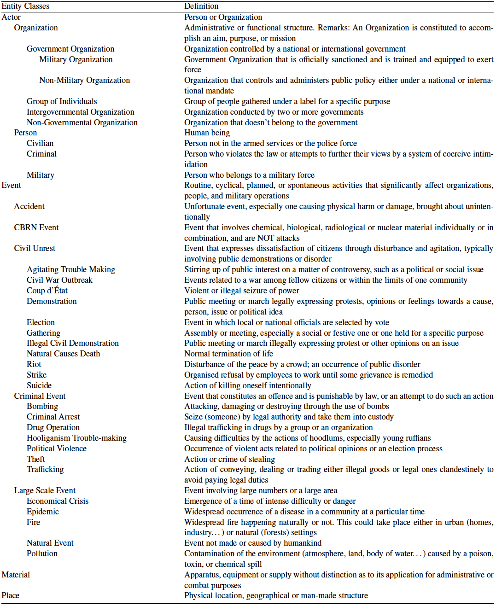

# POPCORN Dataset

<p align="justify"> This directory contains the POPCORN French dataset. This dataset is divided into 400 validation and 400 training texts. The texts in this dataset were written and annotated manually. The texts are short and factual, in the style of an information report. Annotation based on the ontology described below enables training and evaluation of Information Extraction (Name Entity Recognition, Coreference Resolution and Relation Extraction) models. </p>

## POPCORN Dataset Format
The annotated texts are stored inside the corpus folder of this repository and split between the "train.json" and "test.json" files. Each file contains 400 texts stored as a 3 keys dictionary : 

```rb
{
 "text": "the raw text as a string",
 "entities": [{
                "id": "id of the textual entity",
                "mentions": [{
                              "value": "textual value of the mention"
                              "begin": "offset of the begin of the mention in the text as integer",
                              "end": "offset of the end of the mention in the text as integer"
                             },
                             ...
                            ],
                "type": "entity type as a string",
                "formatted_value": "formatted value if the entity is an attribute"
               },
               ...
              ],
 "relations": [ [subject_id, predicate, object_id],
                ...
               ]
}
```

## POPCORN Ontology
This section lists the different types of entities, attributes and relations used to annotate the dataset.




# Citation

# Contact
If you have any questions, please contact cedric.lopez@emvista.com

